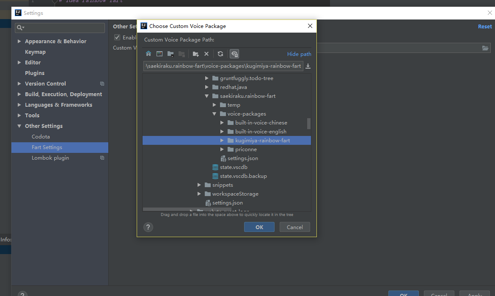

# idea-rainbow-fart
一个在你编程时疯狂称赞你的 IDEA扩展插件,兼容VSCode版本语音包 | An IDEA extension that keeps giving you compliment while you are coding, it will checks…


## 缘起

是否听说过程序员鼓励师，不久前出了一款vscode的插件rainbow-fart，可以在写代码的时候，匹配到特定关键词就疯狂的拍你马屁。


vscode的下载尝试过，但是作为日常将IDEA作为主力生产工具的同学来说，如何体验呢? 于是假期花了一点时间，写了一个idea版本的插件[idea-rainbow-fart](https://github.com/jadepeng/idea-rainbow-fart)。

## 安装方法


先到[https://github.com/jadepeng/idea-rainbow-fart/releases](https://github.com/jadepeng/idea-rainbow-fart/releases) 下载最新的插件。


下载rainbow-fart-1.0-SNAPSHOT.zip，然后打开Idea的插件目录，比如笔者的目录是`C:\Program Files\JetBrains\IntelliJ IDEA 2018.2.4\plugins`

将`rainbow-fart-1.0-SNAPSHOT.zip`解压到plugins目录，如图所示：


然后重启IDEA即可。

## 使用说明

默认使用中文语音包，可以在setting里设置

打开设置：


选择第三方语音包：



可以到 [https://github.com/topics/vscode-rainbow-fart](https://github.com/topics/vscode-rainbow-fart) 查找语音包。

点击确定生效：


## 原理

没啥原理，就是一款简单的idea插件，对没写过插件的我来说，需要先看下官方文档，基本上看下面这一篇就OK：

https://www.jetbrains.org/intellij/sdk/docs/basics/getting_started.html


### 读取语音包

先来看下语音包的设计：

```json

{
  "name": "KugimiyaRie",
  "display-name": "KugimiyaRie 钉宫理惠 (Japanese)",
  "avatar": "louise.png",
  "avatar-dark": "shana.png",
  "version": "0.0.1",
  "description": "傲娇钉宫，鞭写鞭骂",
  "languages": [
    "javascript"
  ],
  "author": "zthxxx",
  "gender": "female",
  "locale": "jp",
  "contributes": [
    {
      "keywords": [
        "function",
        "=>"
      ],
      "voices": [
        "function_01.mp3",
        "function_02.mp3",
        "function_03.mp3"
      ]
    },
	...
	]
}
```

对Java来说，定义两个bean类，解析json即可：


``` java
/**
     * 加载配置
     */
    public static void loadConfig() {
        try {
            //
            FartSettings settings = FartSettings.getInstance();
            if (!settings.isEnable()) {
                return;
            }
            String json = readVoicePackageJson("manifest.json");
            Gson gson = new Gson();
            Manifest manifest = gson.fromJson(json, Manifest.class);
            // load contributes.json
            if (manifest.getContributes() == null) {
                String contributesText = readVoicePackageJson("contributes.json");
                Manifest contributes = gson.fromJson(contributesText, Manifest.class);
                if (contributes.getContributes() != null) {
                    manifest.setContributes(contributes.getContributes());
                }
            }
            Context.init(manifest);

        } catch (IOException e) {
        }
    }
```

### 监控用户输入

自定义一个Handler类继承TypedActionHandlerBase即可，需要实现的方法原型是：

`public void execute(@NotNull Editor editor, char charTyped, @NotNull DataContext dataContext)`

chartTyped就是输入的字符，我们可以简单粗暴的将这些组合到一起即可，用一个list缓存，然后将拼接后的字符串匹配关键词。

``` java
     private List<String> candidates = new ArrayList<>();

    @Override
    public void execute(@NotNull Editor editor, char charTyped, @NotNull DataContext dataContext) {
        candidates.add(String.valueOf(charTyped));
        String str = StringUtils.join(candidates, "");
        try {
            List<String> voices = Context.getCandidate(str);
            if (!voices.isEmpty()) {
                Context.play(voices);
                candidates.clear();
            }
        }catch (Exception e){
            // TODO
            candidates.clear();
        }

        if (this.myOriginalHandler != null) {
            this.myOriginalHandler.execute(editor, charTyped, dataContext);
        }
    }
```

匹配关键词更简单,将读取出来的json，放到hashmap中，然后遍历map，如果包含关键词就作为语音候选：

``` java
    public static List<String> getCandidate(String inputHistory) {


        final List<String> candidate = new ArrayList<>();

        FartSettings settings = FartSettings.getInstance();
        if (!settings.isEnable()) {
            return candidate;
        }
        if (keyword2Voices != null) {
            keyword2Voices.forEach((keyword, voices) -> {
                if (inputHistory.contains(keyword)) {
                    candidate.addAll(voices);
                }
            });
        }
        if (candidate.isEmpty()) {
            candidate.addAll(findSpecialKeyword(inputHistory));
        }
        return candidate;
    }
```

如果找到候选，就播放。

### 播放

为了防止同时播放多个语音，我们用一个单线程线程池来搞定。播放器使用`javazoom.jl.player.Player`


``` java
  /**
     * play in a single thread pool
     */
    static ExecutorService playerTheadPool;
	static {
        ThreadFactory playerFactory = new ThreadFactoryBuilder()
                .setNameFormat("player-pool-%d").build();
        playerTheadPool = new ThreadPoolExecutor(1, 1,
                0L, TimeUnit.MILLISECONDS,
                new LinkedBlockingQueue<>(1024), playerFactory, new ThreadPoolExecutor.AbortPolicy());
    }
	
	public static void play(List<String> voices) {

        FartSettings settings = FartSettings.getInstance();
        if (!settings.isEnable()) {
            return;
        }
        // play in single thread
        playerTheadPool.submit(() -> {
            String file = voices.get(new Random().nextInt() % voices.size());
            try {
                InputStream inputStream = null;
                if (StringUtils.isEmpty(settings.getCustomVoicePackage())) {
                    inputStream = Context.class.getResourceAsStream("/build-in-voice-chinese/" + file);
                } else {
                    File mp3File = Paths.get(settings.getCustomVoicePackage(), file).toFile();
                    if (mp3File.exists()) {
                        try {
                            inputStream = new FileInputStream(mp3File);
                        } catch (FileNotFoundException e) {
                        }
                    } else {
                        return;
                    }
                }
                if (inputStream != null) {
                    Player player = new Player(inputStream);
                    player.play();
                    player.close();
                }
            } catch (JavaLayerException e) {
            }
        });
    }
```

## end

开源地址： https://github.com/jadepeng/idea-rainbow-fart

欢迎大家点赞！
